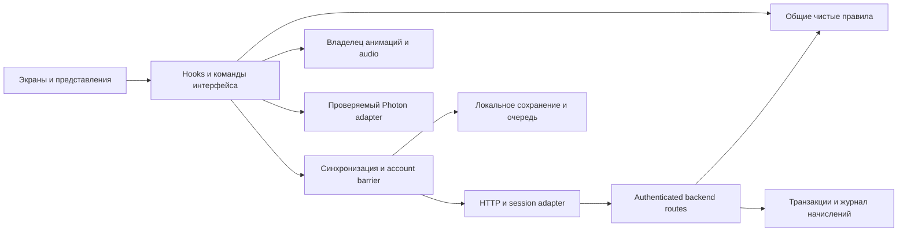

# Инженерные правила Tic Tac Toe Plus

Дата введения: 2026-09-07. Это правила разработки и проверки изменений. Продуктовые решения остаются в GAME_DESIGN.md; исходный независимый аудит — в [technical-architecture-android-audit.md](technical-architecture-android-audit.md). Результат текущего внедрения фиксируется отдельно в [engineering-hardening-2026-09-07.md](engineering-hardening-2026-09-07.md).

## 1. Что проверяется автоматически

| Проверка | Команда / место | Какую ошибку останавливает |
|---|---|---|
| Границы модулей | `npm run check:architecture` | Runtime-циклы; путь frontend → backend/DB; backend → UI/platform; React/DOM/transport/storage внутри pure rules; новый неклассифицированный игровой модуль |
| Типы | `npm run typecheck` | Несогласованные контракты, пропущенные поля, несовместимые cleanup; импорт `.ts` разрешён при `noEmit` |
| Поведение | `npm test` | Повторное начисление, гонки квоты, stale response, переключение аккаунта, отмена lifecycle, ограничения Photon, rollback SQL, границы payload |
| Стиль / React | `npm run lint` | Ошибки hooks, зависимостей эффектов и кода; временные результаты в `work` не считаются исходниками |
| Обе production-сборки | `npm run build`, `npm run android:web` | Web/Worker и отдельно локальный Android entrypoint, плагины сборки, bundled assets и WebView preflight |
| Android web budget | `npm run check:android-web` | Суммарный размер готовых локальных web assets и стартового JavaScript с транзитивными статическими imports/re-exports; пустой output или symlink не допускаются |
| Всё выше | `npm run quality` | Единая последовательность для локальной проверки и GitHub Actions |
| Android release policy | Gradle `testReleasePolicy`, `bundleRelease` | Toolchain/profile, запрещённые app rules, лимиты AAB/DEX/native/web, метаданные release |
| Android native unit | Gradle `testDebugUnitTest` | Владение native callback, отмена, ограниченный повтор инициализации |
| Android lint | Gradle `lintRelease`, затем `scripts/check-android-lint.mjs` | Полный отчёт отдельно от сравнения с конкретным историческим vendor-исключением; новая ошибка или просроченное исключение проваливают сравнение |

`pnpm run quality` также работает в уже установленном окружении. Канонический lockfile — **package-lock.json**; на чистой машине использовать `npm ci`. Не создавать второй lockfile и не менять способ разрешения зависимостей ради локального launcher. CI использует Node 24.19.0, read-only permissions и commit-pinned официальные checkout/setup-node. CI не получает Android-подпись и не публикует сборки.

Скрипты проверяют установленные границы, а не абсолютную правильность программы. Например, AST-проверка не доказывает отсутствие reflection, дорогого алгоритма или логической ошибки; VM/SQLite-fixtures не заменяют React renderer, Photon service, D1 deployment и Android device tests.

## 2. Рабочий цикл без повторного полного аудита

1. Зафиксировать исходный commit, собственные и чужие изменения; назвать наблюдаемую ошибку или измеряемую цель. Для бага — сначала воспроизводящий тест, а не набор regex по исходнику.
2. Выбрать владельца ответственности и существующий путь расширения. Найти текущие callers, validators, persistence и cleanup. Не перечитывать весь проект для локальной правки, если граница не меняется.
3. Сохранить механику, экономику, контракты и формат данных при рефакторинге. Изменение любого из них оформить отдельным решением с совместимостью и миграцией.
4. Внести маленькую завершённую правку, обновить поведенческие тесты. Проверка нового правила должна вызывать реальную функцию/SQL, а не повторять её код в тесте.
5. Выполнить `quality`. Для Android release-кандидата — протокол ниже. При падении исправить причину; не повышать бюджет и не расширять исключение автоматически.
6. Зафиксировать результат, ограничения и только свои файлы; опубликовать проверенные source/web изменения в рамках действующего разрешения. APK/AAB автоматически не публиковать.

Полная матрица исключения рекламных сетей нужна при смене SDK/profile или доказанном росте артефакта. Для обычного UI/игрового изменения достаточно автоматических порогов, сравнения с baseline и релевантных runtime-тестов. Полный аудит повторяется при смене доверенной архитектуры, модели хранения/экономики, стека медиации или существенной регрессии.

Заключительный проход по текущему профилю: [optimization-closeout-2026-09-07.md](optimization-closeout-2026-09-07.md). Стартовый JS ограничен 340 000 bytes в `quality`; считаются весь статический граф и повторно используемые модули, а не только файл с именем `index`. Вторичные экраны допускают lazy loading с понятным ожиданием, возвратом в меню и обработкой ошибки. Первый игровой ход нельзя запускать за загрузочным экраном ради формального уменьшения entry chunk. Не разделять код на дополнительные запросы без измерения стартового и общего размеров.

Движение указателя обновляет визуальное состояние максимум один раз за кадр, используя последний sample. `pointerup` всегда проверяет собственные координаты сразу; изменения положения поля не заменяются вечным cache геометрии. Проверять завершение до RAF, повторное завершение и отмену при уходе/размонтировании. Счётчики вызовов в синтетическом тесте не являются измерением FPS устройства.

## 3. Модульные границы и контрольный рефакторинг



Нынешняя папка `app/game` смешанная исторически. [architecture-policy.json](../engineering/architecture-policy.json) классифицирует её файлы явно. Перемещать десятки файлов для красивой структуры сейчас не требуется. Новый файл получает классификацию по ответственности; классификацию нельзя менять на adapter только для обхода запрещённой зависимости.

- `usePlayerCollection` хранит представление коллекции и локальные команды. `useCloudAccount` владеет синхронизацией, retry и Google transition. `useElementProgression` вызывает предоставленный commit-port; напрямую в localStorage не пишет.
- `account-operation-gate` представляет исключительность смены аккаунта и владение рекламной попыткой. `player-progress-client` владеет session generation, HTTP и заголовками. `progress-sync` подтверждает FIFO только для нужного аккаунта и действующего lifecycle.
- `GameClient` остаётся composition root. Следующий повод для выделения match controller — добавление authoritative режима; не переносить туда HTTP, SQL, сохранение и реализацию эффектов.
- `network-message` — ограниченная runtime-проверка текущего wire state. `satisfies Record<keyof GameState, ...>` требует обновить validator при добавлении поля. Изменение wire state всё равно нуждается в версии протокола перед совместимостью разных релизов.
- `AnimationSequence` владеет таймерами, frames и Web Animations. Network matchmaking живёт независимо от декоративной анимации.
- Backend вправе повторно вызвать общие валидаторы. Это намеренная проверка доверия, а не дублирование, которое надо убрать.

Критерий выделения модуля — смешанные зависимости и причины изменения: например, одно действие начинает одновременно менять авторизацию, кошелёк и анимацию. Число строк само по себе не является критерием. Не вводить универсальные event bus, репозитории и state machines без конкретных состояний и потребителей.

## 4. Аккаунт, очередь и начисления

Состояния синхронизации: `restoring`, `syncing`, `ready`, `offline`, `auth-required`, `rate-limited`, `conflict`. Их значения различаются для пользователя и retry:

| Событие | Действие |
|---|---|
| Сеть/таймаут/5xx/408/`progress-busy` | Сохранить operationId и FIFO; ограниченный exponential backoff с jitter; повтор при восстановлении связи/возврате в foreground |
| 429 | Сохранить очередь; ждать `Retry-After`; рекламная квота без заголовка получает консервативный fallback в час |
| 401/403 | Сохранить прежнюю identity и очередь; явное восстановление входа |
| Постоянная ошибка команды | Сохранить очередь и показать конфликт; остановить новые экономические команды; не повторять бесконечно |
| Смена аккаунта | Захватить barrier **до** первого await; дождаться допустимой очереди; рекламная попытка не может поменять владельца |
| Поздний ответ/другой accountId | Не применить состояние и не удалить pending operation |

HTTP-запрос имеет deadline 20 секунд и освобождает таймер/abort listener. Повтор с тем же operationId безопасен только настолько, насколько сервер действительно реализует идемпотентность конкретного endpoint. `Retry-After` интерпретируется как delay-seconds или HTTP-date; сервер открывает этот заголовок для Android CORS. Основание: [RFC 9110, Retry-After](https://www.rfc-editor.org/rfc/rfc9110.html#name-retry-after).

Текущая квота rewarded — **20 начислений по 50 монет за скользящий час**, не за сутки. Проверка квоты, запись ledger и изменение wallet происходят в одной D1 batch transaction. `balance_after` считается внутри SQL из текущего wallet. Тестируются 19+2 конкурентных запроса, серия сверх лимита, повтор одного ID и rollback. D1 гарантирует транзакционное выполнение batch и откат при ошибке statement: [D1 batch](https://developers.cloudflare.com/d1/worker-api/d1-database/#batch).

Оставшиеся обязательные миграции, а не скрытые обещания текущего кода:

- Snapshot и очередь сейчас находятся в разных localStorage keys. Откат очереди при синхронном отказе записи улучшает поведение, но не выдерживает убийство процесса между двумя успешными записями и не координирует несколько вкладок. Следующий формат должен атомарно хранить account, snapshot, ordered operations и version либо использовать IndexedDB transaction. [HTML Storage](https://html.spec.whatwg.org/multipage/webstorage.html) не даёт приложению межконтекстный lock.
- Earned attempt пока не имеет долговечного vendor/server receipt. Barrier предотвращает перенос на другой аккаунт в живом процессе; смерть процесса/ошибка постоянного хранения требует durable reconciliation. Не обещать гарантированное начисление при любом уничтожении Activity/process.
- Старые progression receipts не содержат оригинальный payload. Для привязки ID к команде нужны version + canonical payload hash + политика legacy replay; добавление поля в JSON receipt тоже меняет формат данных, даже без DDL.
- Автоматическое разрешение постоянного конфликта требует rebase всей зависимой цепочки на свежем серверном снимке. Нельзя просто удалить первый неудачный claim и сохранить покупки, сделанные на его локально начисленные монеты.

## 5. Правила будущих механик и продуктов

| Добавление | Обязательные изменения и проверки |
|---|---|
| Карта/механика | Один стабильный `CardKind`, definition, collection/mechanic metadata, domain effect и target validation; тесты допустимых/недопустимых целей и фаз; один путь для bot/local/online; validator/serialization учитывают новое поле |
| Новый режим | Политика доступной колоды/XP/result proof; один domain engine; UI/transport adapter; не копировать условие режима в каждый экран |
| Ranked / authoritative | Сначала versioned commands, match ownership, RNG seed/state, headless scheduler, replay/duplicate/out-of-order tests. Клиентская анимация и Peer host не подтверждают результат; сервер выдаёт progression по доказанному результату |
| Сезон / пропуск | `seasonId`/`passId`, версия reward table/economy, фиксированная история claimed rewards, миграция старого progress, replay после rollover и timezone boundary |
| Несколько колод | Стабильные ID и общий bounded transport; тест максимальной валидной библиотеки; revision/conflict policy до нескольких устройств. Нынешний whole-library LWW не выдавать за разрешение конфликтов |
| Косметика / entitlement | Разделить ownership, источник права и equipped selection; server validation; idempotent grant/revoke; восстановление purchase; не заменять это ещё одним premium boolean |
| Валюта / reward descriptor | Общий каталог и исчерпывающий handler; атомарное начисление всех составляющих; уникальность receipt не должна запрещать несколько ledger entries одной команды |
| Новая интеграция | Один adapter с lifecycle, deadline/retry/error policy; размер/keep rules/native ABI и разрешения до принятия зависимости |

Тестовый premium и клиентский `record-round` остаются прототипными границами доверия. Перед платёжным/рейтинговым релизом их нужно закрыть server proof/verifier и production feature policy. Не удалять тестовые возможности и не менять экономику под видом рефакторинга.

## 6. Android: сборка и защита бюджета

Подробности native implementation и поддерживаемые команды: [android-engineering.md](android-engineering.md).

Единый поддерживаемый профиль: Java 21, compile/target SDK 36, min SDK 25, AGP 9.3.2, Gradle 9.5.0, R8 9.4.14, MAS 4.18.1. Сохраняются 11 сетей и отключённый `mintegral:ironsource`. Значения и бюджеты находятся в [release-policy.json](../android-config/release-policy.json).

| Метрика | Baseline аудита, bytes/count | Порог review |
|---|---:|---:|
| AAB | 35 039 520 | 38 500 000 |
| Все DEX, включая Meta asset | 40 548 224 | 42 500 000 |
| Class definitions всех DEX | 42 208 | 45 000 |
| Method-ID slots всех DEX | 272 189 | 286 000 |
| Native bytes | 3 460 752 | 3 650 000 |
| Native entries | 20 | 20 |
| Bundled web bytes | 1 153 777 | 1 500 000 |

Это выбранный запас для обнаружения регрессий, а не разрешение расходовать его без причины. Method-ID slots включают ссылки и не равны числу определений методов. AAB включает mapping/metadata и не равен Play download/install size. Отдельный существующий gate R8 coverage сохраняется; расширять его ради удаления сети нельзя.

`bundleRelease` выполняет release policy/optimization checks автоматически. При подготовке релиза:

```powershell
npm run android:sync
Push-Location android
.\gradlew.bat --max-workers=2 testDebugUnitTest testReleasePolicy bundleRelease assembleRelease
Pop-Location
```

На этой машине настроены Java/SDK под ignored `work/android-tools`; в чистом окружении использовать установленный Java 21 и свой Android SDK. [write-android-sdk-location.mjs](../scripts/write-android-sdk-location.mjs) создаёт корректно escaped SDK location; не копировать машинные абсолютные пути в Git. На машине с 16 GiB и малым свободным RAM release эксперименты выполнять последовательно, с 2 workers и 4 GiB Gradle heap. На другой машине ресурсы выбираются по её свободной памяти.

Для полного lint записать UTC-время перед запуском и проверить свежий raw report:

```powershell
$releaseLintStarted = [DateTimeOffset]::UtcNow.ToString('o')
Push-Location android
.\gradlew.bat --max-workers=2 lintRelease --rerun-tasks
Pop-Location
node scripts/check-android-lint.mjs --report android/app/build/intermediates/lint_intermediate_text_report/release/lintReportRelease/lint-results-release.txt --started-at $releaseLintStarted --output work/release-lint.json
```

Сначала зафиксировать exit code самого Gradle. `fullLintStatus=failed` остаётся ошибкой полного lint, даже если `regressionStatus=no-new-errors`. Единственное исключение — конкретная vendor notification path Picasso; совпадение ограничено ID, source, line/message, count и сроком review. Никаких global lint suppressions. Локальный PropertyEscape исправлен точечной заменой SDK path; его возврат считается новой ошибкой.

Для кандидата проверить signing verification и 16 KiB ZIP alignment APK существующими Android tooling checks; подпись не менять. Проверки ELF внутри AAB и ZIP layout APK — разные проверки. Файлы подписи читает только действующий signing workflow; содержимое не открывать и не печатать. Никаких `adb install`, uninstall, clear или загрузки в Google Play в обычном инженерном gate.

## 7. WebView, SDK и R8

Владелец выбрал **WebView Chromium 111+** при прежнем min SDK 25. [android-webview-policy.ts](../build/android-webview-policy.ts) связывает native minimum, Vite target и локальную страницу обновления. Дополнительный ES5 preflight выполняется до загрузки module entry, в том числе для provider, у которого native product version не равен Chromium major. Fallback не требует сети, плагинов или автоматической установки обновления. Поддержка floor требует проверки новых runtime API, не только JS syntax.

Для обновления MAS/сети:

1. Проверить первичные release notes, Maven metadata и vendor compatibility table. Отсутствие ответа Yodo1 не означает одобрение ручной подмены SDK.
2. Зафиксировать старый graph, новый graph, merged manifest/consumer rules и версии transitive dependencies; не выбирать конфликтующую транзитивную версию через `force`.
3. Измерить AAB, все DEX, методы/классы, native/ABI/ELF, packaged web, R8 coverage/metadata. Использовать Configuration Analyzer и точечный whykeeping для изменившихся удержаний.
4. Если есть значительный рост — controlled one-variable experiment. Сопоставить marginal cost с mediation routes и доступными fill/revenue данными. Не удалять обязательную/единственную цепочку по размеру.
5. Обновить baseline только вместе с объяснением измеренной цены и принятого риска. Доход неизвестен — так и записать.

Запрещены перепаковка AAR для consumer-rule surgery, глобальные `-ignorewarnings/-dontoptimize/-dontshrink/-dontobfuscate`, неподдерживаемые SDK/adapter overrides и отключение сети ради красивого процента. Широкие правила MAS/вендоров пока остаются предметом официального решения. [R8 Configuration Analyzer](https://developer.android.com/topic/performance/app-optimization/r8-configuration-analyzer) объясняет keep restrictions; увеличение coverage само по себе не является измерением скорости или фактором ранжирования приложения.

## 8. Runtime performance: отдельный короткий протокол

Изменения размера и количества handles можно проверить без телефона. Startup, CPU, PSS/heap, jank и стабильность WebView нужно измерять отдельно, на одном устройстве/provider/build и сопоставимых условиях.

- Зафиксировать APK SHA, Android/API, WebView package/version, модель, thermal/battery mode и настройки анимаций; использовать synthetic test account без экспорта данных пользователя.
- Cold/warm startup: не менее 10 повторов каждого сценария, median/p95; отделить native Activity, WebView ready, game interactive и ad SDK initialization. Не вычитать фиксированный splash на глаз. [Android startup](https://developer.android.com/topic/performance/vitals/launch-time).
- Нагрузка: одна и та же колода/последовательность действий; меню → магазин → reveal → колода/пропуск → матч → reconnect. Perfetto/Android profiler: main-thread time, long frames, JS/renderer CPU; memory/PSS до и после серии циклов и после idle. [Android memory](https://developer.android.com/topic/performance/memory).
- Стабильность: background/foreground, rotate/recreate, disconnect during connect/import, no-fill/init failure, ad earned/closed, session expiry и account switch. Для реальной рекламы использовать поддерживаемый test mode.
- Настоящий телефон: установка/удаление/очистка только после отдельного разрешения владельца. Read-only ADB не разрешает автоматически подготовить устройство.

Порог runtime-регрессии устанавливается после первого такого baseline с учётом шума измерений. До него нельзя честно писать «startup стал быстрее на X%» или вводить произвольный PSS/FPS budget. Новые тяжёлые эффекты должны иметь reduced-motion/lifecycle policy, а необходимость memoization, virtualisation или RAF batching подтверждается trace/render counts.

## 9. Как давать задачи нейросети

Достаточно указать поведение, ограничения и критерий приёмки; основная дисциплина находится в AGENTS.md и проверках. Рабочая формулировка:

> Исправь/добавь [конкретное поведение] в текущем репозитории. Сохрани [механику/экономику/контракты, если это рефакторинг]. Следуй AGENTS.md и engineering-standards.md. Сначала найди существующий доменный путь и исполняемый сценарий ошибки, затем внеси минимальное завершённое изменение. Прогони quality и релевантный Android release gate, запиши измерения и остаточные ограничения. Не обходи failing gate изменением baseline/исключений без обоснования. Стадируй только свои файлы.

Не поручать модели «добиться 100% R8», «разбить все большие файлы», «убрать дублирование серверных проверок» или «сделать зелёным любым способом». Критерий приёмки — наблюдаемое поведение и сохранённые границы. Это уменьшает частоту дорогих аудитов; не отменяет пересмотр архитектуры перед ranked, платежами, сезонами и сменой mediation stack.
