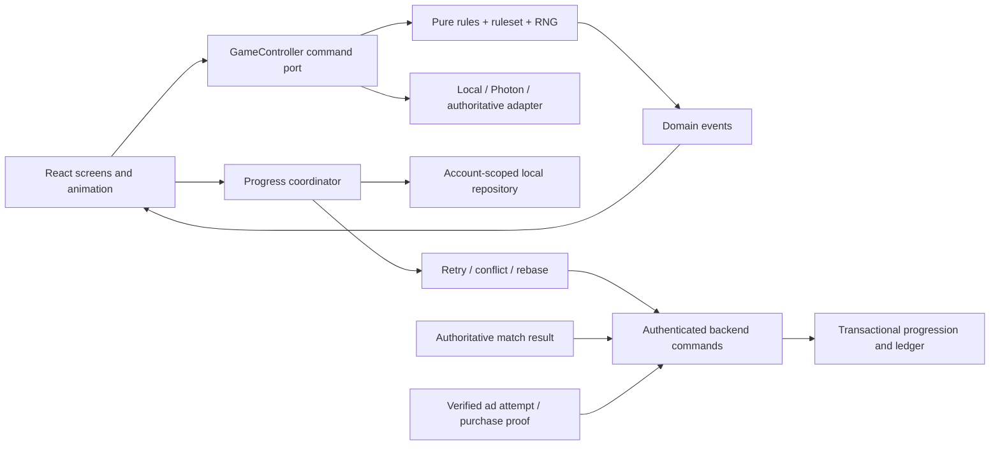

# Tic Tac Toe Plus: технический, архитектурный и Android-аудит

Последующее внедрение и текущие ограничения: [engineering-hardening-2026-09-07.md](engineering-hardening-2026-09-07.md). Этот аудит сохраняет исходный baseline и исторические находки.

Дата: 7 сентября 2026 года. Проверен только самостоятельный `TicTacToeWeb`. Это независимый технический отчёт; он не изменяет геймдизайн, экономику или утверждённый набор сетей.

## 1. Пять главных выводов

1. **Самый срочный дефект — жизненный цикл синхронизации аккаунта.** На настоящих клиентских функциях с синтетическим transport воспроизведено: покупка меняет баланс 220→170, reconnect с пустой очередью возвращает 220. После Google switch возвращается снимок прежнего аккаунта. Причина — навсегда сохранённый успешный `initializationPromise`, а не серверная двойная выдача. Следующий технический шаг — regression-тесты и разделение инициализации сессии, refresh snapshot и account generation (§ 5, B1).
2. **27% R8 coverage подтверждены, но они не описывают весь Android payload.** Fresh baseline: AAB 35 039 533 B; четыре `base/dex/*.dex` — 35 530 316 B. Дополнительно Meta поставляет `base/assets/audience_network.dex` размером 5 017 908 B: все упакованные DEX вместе — **40 548 224 B**. Coverage 27,02 / 27,15 / 27,14% нельзя превращать в процент сэкономленных байтов, RAM или прогноз ранжирования.
3. **Успешная сборка зависит от подавления предупреждений внутри Pangle.** Контролируемое исключение Pangle завершилось ошибкой R8 на отсутствующих Meta `Nullsafe` / `Nullsafe$Mode`: их скрывает vendor `-ignorewarnings` в baseline. Это воспроизводимый межбиблиотечный эффект. Безопасное продолжение — ответ Yodo1 и поддерживаемое исправление зависимостей/consumer rules; локального blanket workaround нет.
4. **Текущие Photon и прогрессия остаются прототипными границами доверия.** Peer может передать непроверенное состояние, отменённый connect способен завершиться позже; reducer использует внешний RNG и React-таймеры переходов. Отдельно две конкурентные rewarded-выдачи обходят часовой лимит и дают неверный `balance_after`. Ranked, платежи и entitlement нельзя строить поверх этих предположений без перечисленных миграций.
5. **Три безопасные правки проверены, но полный Android lint ещё не зелёный.** Tests 126/126, JS lint, production build, TypeScript и штатный Android release gate прошли. Дополнительный `lintRelease` выявил 3 errors / 20 warnings (§5, A3), они не подавлялись. Runtime-циклов среди 126 собственных TS/TSX-модулей не найдено. Реальные startup/CPU/PSS/frame-time не измерены: ADB не видит устройств. Условия splash, WebView floor и рост истории animation timers подтверждены кодом; это основания для device tests, а не заявления об измеренном FPS.

## 2. Baseline и воспроизводимость

### Область и ограничения

Перед работой полностью прочитаны `AGENTS.md`, `README.md`, `GAME_DESIGN.md`, `android-config/NETWORK_OPTIMIZATION.md`, `docs/android-toolchain-check-2026-09-03.md`, `docs/yodo1-r8-support-request.md`, `docs/infrastructure.md`, `docs/backend-foundation.md`.

Начальный HEAD: `e0e8cbfcebf002ac72b667e980574d166ad5502a`. На старте уже изменены GAME_DESIGN/backend-foundation, присутствуют новый отчёт по монетизации и `android/.idea`. Во время аудита другая работа также обновляла документацию. Эти изменения не относятся к аудиту и не включены в его исправления. Исходники приложения зафиксированы в `work/technical-audit-2026-09-07/source-inventory.json` с SHA-256 каждого файла. Полезная разница между снимками — три перечисленные в § 8 правки.

Содержимое `android-config/private`, подпись, токены, production API/БД и локальные пользовательские базы не открывались. Штатная release-задача использовала существующую настройку подписи без её изменения или вывода. APK не устанавливался; приложение/данные не удалялись. AAB не публиковался и в Play не загружался. `GAME_DESIGN.md` выводами этого аудита не редактировался.

Среда: Windows, около 15,9 GiB RAM, примерно 638 GiB свободного диска при старте; свободная RAM менялась примерно от 1,7 до 2,4 GiB. Node 24.19.0, доступный launcher pnpm 11.19.0, зависимости из существующего lockfile. Gradle выполнялся последовательно, heap 4 GiB, максимум два workers. Длительности ниже — время выполнения на занятой машине, **не benchmark эффективности исправлений**.

| Проверка | До исправлений | После трёх исправлений |
| --- | --- | --- |
| `pnpm test` | 126/126, exit 0; 2,55 s команды | 126/126, exit 0; 6,41 s |
| `pnpm lint` | exit 0; 15,73 s | exit 0; 116,84 s |
| `pnpm build` | exit 0; 4,44 s | exit 0; 31,02 s |
| `pnpm exec tsc --noEmit --incremental false --allowImportingTsExtensions` | exit 2, три ошибки | exit 0 |

Значительная разница длительностей объясняется различными условиями нагрузки, в том числе одновременной R8-компиляцией и наличием диагностических файлов; регрессия runtime из этого не следует. Обычный build не заменял отдельную проверку TypeScript.

### Android-конфигурация и свежая сборка

Применены Java 21, AGP 9.3.2, Gradle 9.5.0 и явно закреплённый R8 9.4.14; compile/target SDK 36, min SDK 25. MAS 4.18.1, локально упакованный Capacitor-клиент, rewarded API. Minification, resource shrinking и full-mode optimization включены; vendor AAR не переписывались. Production profile сохраняет 11 сетей и отключённый маршрут Mintegral→ironSource. AdMob/AppLovin обязательны.

Источники конфигурации: `android/build.gradle:9–10`, `android/gradle/wrapper/gradle-wrapper.properties:3–4`, `android/app/capacitor.build.gradle:5–6`, `android-config/app.properties:3–8`, `android/app/build.gradle:74–75`, `android/gradle.properties:4`. Wrapper checksum закреплён. ABI: armeabi-v7a и arm64-v8a. В AAB R8 metadata optimization/obfuscation/shrinking/access modification/repackaging/optimized resource shrinking равны true, compatibility mode и debug mode — false. Это подтверждение фактической release-конфигурации, а не только намерения в Gradle.

`releaseRuntimeClasspath` и `verifyRewardedNetworks` подтвердили **42 MAS modules / 11 networks**, без `com.yodo1.mas:full`; проверяются точные координаты и версии. Разрешённые сетевые SDK:

| Сеть | Фактически разрешённый SDK |
| --- | --- |
| AdMob | Google Mobile Ads 24.9.0 |
| AppLovin | 13.5.1 |
| Bigo | 5.7.0 |
| Meta Audience Network | 6.20.0 |
| DT Exchange | marketplace-sdk 8.4.2 |
| InMobi | Kotlin SDK 11.1.1 |
| ironSource / LevelPlay | mediation-sdk 9.3.0 |
| Mintegral | 17.0.61 |
| Moloco | 4.4.0 |
| Pangle | 7.9.0.9 |
| Unity Ads | 4.17.0 |

Уже существующий dependency graph повышает запросы GMA 24.4.0 до 24.9.0 и InMobi 11.1.0 до 11.1.1. Новых `force`/подмен версий не добавлялось. Java 21 подтверждена исполняемым toolchain, а не наличием Android Studio.

Fresh baseline создан из зафиксированного web payload до исправлений. После `android:web` и `cap sync` содержимое Android assets оставалось одинаковым во всех вариантах матрицы. Android Gradle tasks не пересобирают TypeScript; более поздние TS-правки не попали в эксперименты. Финальная контрольная сборка прошла отдельно с production profile и новым web payload (§8).

| Метрика свежего baseline | Значение |
| --- | ---: |
| AAB bytes | 35 039 533 |
| SHA-256 AAB | `664997a587b4e78f410baf1cf62b271f23eb2572474214a4acb37ae56584f389` |
| R8 optimization / obfuscation / shrinking | 27,02% / 27,15% / 27,14% |
| `base/dex` count / bytes | 4 / 35 530 316 |
| `base/dex` class definitions / method definitions | 38 973 / 219 001 |
| Сумма method-ID slots четырёх DEX | 244 570 |
| Дополнительный asset DEX Meta | 5 017 908 B; 3 235 classes; 23 731 methods |
| Все packaged DEX bytes / classes / methods | 40 548 224 / 42 208 / 242 732 |
| Native libs count / uncompressed bytes | 20 / 3 460 752 |
| ELF `PT_LOAD` alignment | Все 20 библиотек не ниже 16 KiB |
| Сжатая mapping metadata внутри AAB | 12 350 455 B |
| Время fresh baseline release + verification | 407,53 s |

Method definitions подсчитаны из DEX class data; method-ID slots включают ссылки и могут повторяться между DEX, поэтому это не число уникальных методов приложения. Mapping/seeds/usage — диагностические списки с иной семантикой, их line counts не подменяют DEX definitions. Проверка ELF не равна проверке ZIP alignment сгенерированных Play APK или запуску на устройстве с 16 KiB pages.

`BUNDLE-METADATA/com.android.tools/r8.json` — источник coverage, формула `100 - no*Percentage`. Метаданные AAB подтверждают AGP/R8. Merged manifest подтверждает package `com.MiddleFrame.Tictactoe`, versionCode 49 / 0.7.9, min 25/target 36, `allowBackup=false`, `usesCleartextTraffic=false`, отсутствие разрешённого debuggable. Полная обезличенная сводка компонентов/permissions сохранена в `android/baseline/manifest-summary.json` внутри каталога аудита; значения ad/OAuth identifiers туда не переносились.

В merged manifest **16 permissions и 113 components**: 83 activities, 11 providers, 8 services, 11 receivers. Семь компонентов явно exported, четыре защищены permission; MainActivity, PlayGamesAppShortcutsActivity и Mintegral NetWorkChangeReceiver — без permission. Сам inventory не доказывает уязвимость: нужны анализ допустимых actions и проверок внутри реализаций. Одиннадцать providers — кандидаты на startup work, их реальное время не измерено. В manifest остаются interstitial/app-open/debugger activities, хотя игра вызывает rewarded API.

**Интерпретация размера:** AAB содержит metadata/mapping и библиотеки двух ABI; его размер не равен размеру загрузки на конкретное устройство. Asset `audience_network.dex` обнаружен как файл с DEX header; фактический момент его загрузки/объём resident memory не измерен. R8 application coverage не доказывает оптимизацию содержимого этого готового DEX. Даже сумма всех найденных DEX ниже 50 MB, но окончательную классификацию делает Play после обработки загруженного bundle.

### Команды и сохранённые доказательства

Все тяжёлые/экспериментальные артефакты находятся в игнорируемом `work/technical-audit-2026-09-07/`; они не предназначены для публикации. Профили исключения не коммитятся. В репозиторий включены [portable AAB inspector, генератор временных профилей и инструкция](audit-support/README-android.md); inspector независимо повторил все baseline DEX/native/coverage counts. Для повторения в этой рабочей среде:

```powershell
pnpm test
pnpm lint
pnpm build
pnpm exec tsc --noEmit --incremental false --allowImportingTsExtensions
pnpm run android:web
pnpm exec cap sync android
Set-Location android
.\gradlew.bat :app:bundleRelease :app:testOptimizationVerification --max-workers=2 '-Dorg.gradle.jvmargs=-Xmx4g'
.\gradlew.bat :app:analyzeReleaseR8Config --max-workers=2 '-Dorg.gradle.jvmargs=-Xmx4g'
```

Перед повторением использовать настроенный Java 21 и SDK текущей машины; не печатать private properties и не менять signing identity. После baseline не выполнять `cap sync` между вариантами. Для отдельного варианта копировать `android-config/mas-networks.json` в ignored work, удалять ровно одну сеть из списка и передавать абсолютный путь через `-PmasNetworkProfile=...`. При исключении Mintegral или ironSource также удалить ставший невалидным `disabledRoutes` entry `mintegral:ironsource` из временной копии; это не включает маршрут, а сохраняет валидность профиля. Portable generator делает это автоматически. Каталог маршрутов и production profile остаются неизменными; сохранять артефакт и mapping/configuration/seeds/usage **после каждого успешного варианта**, поскольку следующий Gradle запуск перезапишет app/build.

R8 Configuration Analyzer в AGP 9.3 доступен отдельной задачей; compile-time HTML/PB и финальные embedded scores — разные точки измерения. [Официальная инструкция Analyzer](https://developer.android.com/topic/performance/app-optimization/r8-configuration-analyzer), [AGP 9.3 compatibility/release notes](https://developer.android.com/build/releases/agp-9-3-0-release-notes).

### Merged rules и keep graph

Fresh Analyzer baseline содержит **492 211 live items** до финальной оптимизации. Атрибуция ограничений к источникам правил: ironSource 45 673, Mintegral 42 874, Pangle 40 748, Unity Ads 36 952, InMobi 27 108, AppLovin 21 721, AppHarbr 20 770, DT Exchange 17 345, Bigo 17 222, app-owned 7 939, Moloco 3 127, Meta 1 386. Это пересекающиеся counts классов/полей/методов, не сумма удаляемых классов и не marginal cost. Малое значение Meta особенно обманчиво из-за готового DEX asset.

| Сохранённый baseline artifact | Размер | Дополнительная характеристика |
| --- | ---: | --- |
| `configuration.txt` | 158 794 B | Merged app/vendor/generated rules с origins |
| `mapping.txt` | 131 853 749 B | 39 702 original class mapping lines |
| `seeds.txt` | 23 440 681 B | 287 569 lines, из них 31 281 class-only |
| `usage.txt` | 7 686 244 B | 124 517 lines, 32 607 unindented class entries |
| `configanalyzer.pb` / `.html` | 13 780 761 / 18 581 395 B | Свежий граф и интерактивный Analyzer |

Mapping может содержать больше классов, чем final DEX, вследствие merging/inlining. Unindented entries в usage включают классы с удалёнными членами, а не только целиком удалённые классы. Эти файлы использованы для rules/retention evidence; итоговые class/method counts взяты из DEX.

`work/technical-audit-2026-09-07/android/baseline/configuration.txt:1101–1103` указывает origin `com.pangle.global:pag-sdk-ad:unfat-7909-20260204213520-release`, его глобальный `-ignorewarnings` и широкий ByteDance keep. Baseline diagnostics содержат восемь missing class names: четыре BillingClient, два ByteDance и Meta `Nullsafe`/`Nullsafe$Mode`. Контролируемое исключение Pangle превращает последние два в ошибку сборки (§ 3). App-owned blanket suppression не добавлялось.

## 3. Контролируемая матрица и стоимость сетей/маршрутов

Проверены все **11 исключений по одной сети** на одном frozen web payload и toolchain. Семь вариантов прошли release gate; один создал новый AAB, но был отвергнут gate; один не прошёл R8; два отклонены проверкой обязательных сетей. Ни один gate не отключался. Все восемь новых измеренных AAB сохранили одинаковые 54 web entries по SHA-256. Production profile не менялся. [Компактные измерения и SHA-256](audit-support/android-measurements.json) включены в репозиторий; экспериментальных конфигураций в нём нет.

Размеры — точные bytes. O/Ob/S — optimization/obfuscation/shrinking. «−Сеть» обозначает временный эксперимент, не итоговую конфигурацию приложения.

| Вариант | Результат / seconds | AAB B | R8 `base/dex` B | Все packaged DEX B | O / Ob / S, % |
| --- | --- | ---: | ---: | ---: | --- |
| Baseline: 11 сетей | PASS / 407,53 | 35 039 533 | 35 530 316 | 40 548 224 | 27,02 / 27,15 / 27,14 |
| −AdMob | Mandatory guard / 28,55 | — | — | — | — |
| −AppLovin | Mandatory guard / 2,84 | — | — | — | — |
| −Bigo | PASS / 284,63 | 33 730 515 | 33 982 756 | 39 000 664 | 28,45 / 28,58 / 28,57 |
| −Meta | PASS / 294,10 | 32 581 086 | 35 389 100 | 35 389 100 | 27,12 / 27,24 / 27,24 |
| −DT Exchange | PASS / 269,59 | 33 740 546 | 33 630 856 | 38 648 764 | 28,23 / 28,36 / 28,32 |
| −InMobi | PASS / 259,02 | 32 170 358 | 31 092 672 | 36 110 580 | 25,29 / 25,41 / 25,43 |
| −ironSource | PASS / 310,84 | 32 563 821 | 31 838 380 | 36 856 288 | 30,08 / 30,22 / 30,21 |
| −Mintegral | PASS / 256,57 | 31 538 065 | 30 976 484 | 35 994 392 | 30,40 / 30,53 / 30,53 |
| −Moloco | Coverage gate FAILED / 242,75 | 30 775 938* | 32 320 092* | 37 338 000* | 21,61 / 21,71 / 21,72* |
| −Pangle | R8 missing Meta annotations / 131,67 | — | — | — | — |
| −Unity Ads | PASS / 287,17 | 33 052 544 | 31 835 060 | 36 852 968 | 29,34 / 29,48 / 29,47 |

\* Moloco: упаковка создала новый AAB с SHA-256 `5b7ee1a37598be57b356334bd8d6c7057f13e1a4dcd5aac9f1915754f7ee93e9`, затем `bundleRelease` завершился ошибкой в локальном doLast coverage gate `<25%`. Это измеренный диагностический artifact, **не успешная release-сборка**. Для Pangle/обязательных сетей новый AAB не измерялся; старые файлы не переиспользовались как результат неудачного варианта.

| Вариант | Classes: R8 / все DEX | Method definitions: R8 / все DEX | Method-ID slots: все DEX | Native count / bytes |
| --- | ---: | ---: | ---: | ---: |
| Baseline | 38 973 / 42 208 | 219 001 / 242 732 | 272 189 | 20 / 3 460 752 |
| −Bigo | 36 902 / 40 137 | 208 162 / 231 893 | 260 769 | 20 / 3 460 752 |
| −Meta | 38 747 / 38 747 | 217 551 / 217 551 | 243 365 | 20 / 3 460 752 |
| −DT Exchange | 37 066 / 40 301 | 208 674 / 232 405 | 262 375 | 20 / 3 460 752 |
| −InMobi | 32 676 / 35 911 | 200 489 / 224 220 | 253 284 | 20 / 3 460 752 |
| −ironSource | 35 336 / 38 571 | 196 137 / 219 868 | 247 415 | 20 / 3 460 752 |
| −Mintegral | 35 291 / 38 526 | 192 933 / 216 664 | 243 155 | 20 / 3 460 752 |
| −Moloco* | 35 548 / 38 783 | 204 068 / 227 799 | 253 920 | 20 / 3 460 752 |
| −Unity Ads | 35 342 / 38 577 | 190 368 / 214 099 | 241 345 | 20 / 3 460 752 |

Во всех измеренных вариантах native libraries не только имеют тот же суммарный размер: SHA-256 всех 20 файлов совпадают. Для трёх вариантов без нового AAB class/method/native результаты отсутствуют. Складывать marginal savings разных строк нельзя: whole-program R8 и общие зависимости взаимодействуют.

Сравнение resolved dependency trees выявило естественное изменение версий общих зависимостей при трёх исключениях. Без InMobi: Okio 3.7.0→3.2.0, Guava 33.0.0-android→31.1-android, Exif 1.3.6→1.3.3 и связанные annotation/failureaccess artifacts. Без Unity Ads: protobuf-javalite 3.25.6→3.21.9, kotlin-stdlib-jdk8 1.8.10→1.8.0. Без Moloco: coroutines 1.10.2→1.10.1, Room 2.5.2→2.2.5, SQLite 2.3.1→2.1.0, Work 2.8.1→2.7.0, Media 1.6.0→1.0.0. Остальные retained coordinates сохраняют версии. Это часть эффекта удаления профиля, **не изолированная стоимость SDK при искусственно закреплённом transitive graph**. Неподдерживаемый force ради выравнивания не применялся; точный diff включён в measurement JSON.

### Ранжирование marginal cost и риск удаления

Ранг ниже — по **baseline minus variant для всех DEX**, включая asset DEX. Цена включает собственный SDK, его adapters и зависимые части графа; это не изолированный размер одного AAR. Все риски дохода/fill остаются неизвестными: dashboard, география и реальные показы не исследовались.

| Ранг | Сеть | Сэкономлено DEX / AAB B | Declared routes и риск удаления |
| --- | --- | ---: | --- |
| 1 | Meta | 5 159 124 / 2 458 447 | AdMob, AppLovin, ironSource; удаляет Meta demand во всех трёх. Основной payload — готовый asset DEX, не keep count. |
| 2 | Mintegral | 4 553 832 / 3 501 468 | AdMob, AppLovin; маршрут к ironSource уже исключён. Удаление потеряет обе оставшиеся цепочки Mintegral. |
| 3 | InMobi | 4 437 644 / 2 869 175 | AdMob, AppLovin, ironSource. Coverage при уменьшении DEX падает; это разные критерии. |
| 4 | Unity Ads | 3 695 256 / 1 986 989 | AdMob, AppLovin, ironSource; lost demand неизвестен. |
| 5 | ironSource | 3 691 936 / 2 475 712 | И сеть, и mediator: исчезают 12 MAS modules, а не только один SDK. Самый широкий routing impact. |
| 6 | Moloco* | 3 210 224 / 4 263 595 | AdMob, AppLovin, ironSource; дополнительно нарушен текущий coverage gate. Диагностическая стоимость, не кандидат release. |
| 7 | DT Exchange | 1 899 460 / 1 298 987 | AdMob, AppLovin, ironSource; доход/fill неизвестны. |
| 8 | Bigo | 1 547 560 / 1 309 018 | AppLovin, ironSource; AdMob-маршрута в каталоге нет. |
| — | Pangle | Не установлено | AdMob, AppLovin, ironSource; удаление пока блокируется missing Meta annotations. Keep count не заменяет измерение. |
| — | AdMob / AppLovin | Не установлено | Обязательные MAS mediators; guards соответствуют официальному контракту Yodo1, обход не допустим. |

Источник маршрутов — `android-config/mas-network-catalog.json:3–17` и selection/validation в `android/gradle/rewarded-networks.gradle:11–32`. При исключении ironSource каталог оставляет хотя бы один другой объявленный mediator для остальных сетей; Bigo остаётся только через AppLovin. Это **не доказательство рабочей альтернативы в dashboard**. Ни одну сеть или цепочку этот отчёт не рекомендует отключать без подтверждения Yodo1 и продуктовых данных.

### Существенные изменения keep graph

| Вариант | Live items до final optimization | Изменение к baseline |
| --- | ---: | ---: |
| Baseline | 492 211 | — |
| −Bigo | 471 788 | −20 423 |
| −Meta | 489 867 | −2 344 |
| −DT Exchange | 472 719 | −19 492 |
| −InMobi | 450 150 | −42 061 |
| −ironSource | 449 853 | −42 358 |
| −Mintegral | 444 841 | −47 370 |
| −Moloco* | 421 951 | −70 260 |
| −Unity Ads | 450 537 | −41 674 |

Это свежие Analyzer counts, не final DEX definitions. Удалённый rule-owner исчезает, но surviving-owner attribution тоже меняется: например, без InMobi Meta restrictions растут 1 386→1 758, а без Unity Ads Moloco restrictions уменьшаются 3 127→1 698. Следовательно даже «exclusive» counts относятся к конкретному графу и не задают аддитивный бюджет байтов.

Meta демонстрирует расхождение особенно ясно: всего −2 344 Analyzer live items и −141 216 B R8 DEX, но ещё −5 017 908 B за счёт исчезнувшего asset. FAN consumer rules (`baseline/configuration.txt:2312–2323`) сами описывают dynamically loaded implementation; анализ готового DEX подтверждает её наличие. Это основание запросить поддерживаемый SDK update, а не перепаковывать asset вручную.

### Отдельный эксперимент маршрута

Отдельно исключён только `inmobi:applovin`, все 11 сетей сохранены. Release PASS, 318,78 s; AAB **35 023 317 B**, R8 DEX **35 513 144 B**, все DEX **40 531 052 B**, O/Ob/S **27,04 / 27,16 / 27,15%**. R8/all classes: 38 954 / 42 189; methods: 218 855 / 242 586; all method-ID slots: 272 025. Native остаются 20 / 3 460 752 B.

Экономия — всего **17 172 B DEX и 16 216 B AAB**, 19 classes / 146 method definitions. Analyzer live items 491 987 против 492 211. Версии всех оставшихся dependency coordinates, включая InMobi 11.1.1, совпали с baseline. MAX InMobi consumer rule исчезает, но полный RecyclerView keep остаётся от MAX Meta adapter 6.20.0.0 (`without-route-inmobi-applovin/configuration.txt:2299`). Удаление одной копии перекрывающегося правила почти не освобождает код.

Это не оправдывает отключение маршрута: неизвестен его вклад в fill/revenue, а техническая экономия мала. Production `inmobi:applovin` сохранён. Точечные whykeeping traces финальной production-сборки приведены в §8.

## 4. Поддерживаемые варианты R8 и запрещённые обходы

Проверено 7 сентября по первичным источникам:

- MAS core/full и MAS mediation:pangle Maven metadata показывают latest/release **4.18.1**, дата обновления 20 июля 2026. Changelog также начинается с 4.18.1. Более новый поддерживаемый MAS release в проверенных источниках не найден. [Changelog](https://developers.yodo1.com/docs/sdk/support/changelog/), [core metadata](https://repo.maven.apache.org/maven2/com/yodo1/mas/core/maven-metadata.xml), [full metadata](https://repo.maven.apache.org/maven2/com/yodo1/mas/full/maven-metadata.xml).
- Yodo1 документирует **выбор сетей**, требует AppLovin/AdMob и показывает rewarded как API ad format. Отдельного подтверждённого dependency profile «только rewarded, без остальных форматов и обязательных quality-компонентов» в этих документах не найдено. Наличие rewarded API не означает, что все остальные классы SDK удаляемы. [Custom integration](https://developers.yodo1.com/docs/sdk/guides/android/integration/), [Ad formats](https://developers.yodo1.com/docs/sdk/guides/android/ad-formats/).
- Официальная Yodo1 ProGuard-страница всё ещё содержит широкие keep и глобальный `-ignorewarnings`. Она не предоставляет найденного нами узкого исправления для текущего графа. Копировать её целиком в приложение нельзя в рамках заданных ограничений. Требуется точечный письменный ответ поставщика. [Yodo1 ProGuard](https://developers.yodo1.com/docs/sdk/advanced/proguard/).
- Более новые отдельные adapters существуют: Google Pangle adapter **8.2.0.4.0** подтверждён metadata и официально протестирован с Pangle 8.2.0.4/GMA 25.4.0. Это **не подтверждение совместимости с MAS 4.18.1** и остальными mediator adapters. У LevelPlay тоже есть более новые Mintegral adapters, но его таблица и integration example показывают разные поколения; автоматически подменять текущую зависимость нельзя. [Google Pangle changelog](https://developers.google.com/admob/android/mediation/pangle), [Google Maven metadata](https://dl.google.com/dl/android/maven2/com/google/ads/mediation/pangle/maven-metadata.xml), [LevelPlay Mintegral](https://docs.unity.com/grow/levelplay/sdk/android/networks/guides/mintegral).
- В актуальном Step 3 [официального Google Meta mediation guide](https://developers.google.com/admob/android/mediation/meta) указаны GMA 25.4.0 и адаптер `com.google.ads.mediation:facebook:6.22.0.0`; это более новые версии, но не подтверждение их совместимости с MAS 4.18.1.
- AGP 9.3 требует Gradle 9.5.0; используемая пара соответствует документации. Наличие Android Studio и замена AGP не исправляют consumer rules. Сравнение от 3 сентября с тем же R8 уже показало лишь 0,60% изменения DEX; новый baseline вновь даёт те же coverage.

Безопасный порядок: сохранить измеренный baseline → передать Yodo1 точные origins/whykeeping/missing classes → получить поддерживаемую версию или narrow rules → повторить те же build/graph/size проверки → отдельно проверить callbacks и lifecycle на согласованном test device. До ответа допустимы анализ и тесты, но не изменение списка production-сетей.

Запрещены: переписывание consumer rules внутри vendor AAR/Gradle transform cache; app-level глобальные `-ignorewarnings`, `-dontoptimize`, `-dontshrink`, `-dontobfuscate`; скрытие ошибок необоснованными `-dontwarn`; `force` неподтверждённых SDK/adapters; удаление обязательных MAS компонентов/AdMob/AppLovin; отключение Jetifier без проверки legacy references; отключение release gate ради успешного эксперимента; смена подписи; установка/очистка приложения и Android-публикация без отдельного разрешения.

Google Play объявляет minimum 25% по трём категориям с февраля 2027 для игр с DEX>50 MB. Это порог требований, не обещание роста выдачи при переходе 27→35%. Size, startup, CPU, memory и стабильность имеют отдельные показатели и методы проверки. [Google Play technical quality](https://support.google.com/googleplay/android-developer/answer/17492799?hl=en).

## 5. Архитектурные находки и доказательства

Обозначения: **P1** — существенная ошибка текущего состояния/сети либо обязательная граница до ranked; **P2** — дефект ограниченного сценария, lifecycle или обязательная миграция перед коммерческим расширением; **P3** — гипотеза/ограниченная цена сопровождения. Оценки — инженерные дни одного разработчика с регрессионными проверками, без ожидания vendor, нового backend или устройства. Они не являются сроком всего multiplayer/платёжного проекта.

### B1 — P1: stale snapshot после reconnect и переключения аккаунта

**Место:** `app/game/player-progress-client.ts:109–114`, `:193–196`; `app/components/game/hooks/usePlayerCollection.ts:49–56`, `:66–85`; `app/game/progress-sync.ts:14–16`.

Успешный `initializationPromise` остаётся навсегда. Каждый sync использует его snapshot; пустая очередь возвращает его без нового GET. Реальные функции с fake HTTP/memory storage дали 220→170→220; после Google switch получили snapshot A при сохранённом account B. Это доказанный неверный локальный state/UI, **не доказанная запись сервером в чужой аккаунт**: HTTP использует действующую сессию. Возможны неверные следующие intents и `account-changed` для результатов раунда.

**Порядок/цена:** 1–2 дня, сейчас. Сначала тесты empty-queue refresh/A→B→reconnect/late response/expired session; затем разделить дедупликацию создания сессии и refresh прогресса, добавить account generation и проверку перед применением ответа. Одного исправления `setCoins` недостаточно. В этом аудите не изменялось.

### B2 — P1: постоянная ошибка в начале FIFO блокирует все следующие действия

**Место:** `app/game/progress-sync.ts:13–17`; `app/game/player-progress-client.ts:75–79`; `app/components/game/hooks/usePlayerCollection.ts:81–83`; `app/api/progression/route.ts:22–23`.

Любой rejection прекращает flush. `reward-unavailable`, `invalid-deck-library`, `account-changed` повторяются с тем же intent бесконечно при последующих sync. Probe: три попытки первой claim, ноль отправок следующего reward-ad, обе операции остаются pending. Реальный источник — конфликт награды/баланса двух устройств. Ошибка транспорта теряет HTTP status/Retry-After, а `cloudReady=false` смешивает конфликт с offline. API может восстановиться без нового browser online event; тогда до следующего действия retry нет.

**Ущерб:** новые покупки, XP и профиль не синхронизируются при рабочей сети. **Порядок/цена:** 2–4 дня после B1: типизированные ошибки, ограниченный retry для 429/503 с Retry-After/jitter, отдельное conflict/rebase состояние. Нельзя просто удалить любой 400 из очереди: следующие покупки могли зависеть от отвергнутого начисления.

### B3 — P2: очередь и snapshot сохраняются неатомарно

**Место:** `usePlayerCollection.ts:146–153`; `useElementProgression.ts:32–35` в `app/components/game/hooks`; `app/game/progress-operation-queue.ts:23–27`; `app/game/local-player-progress.ts:118–123`.

Queue `setItem` и snapshot `setItem` — разные записи, затем отдельно обновляются legacy keys. Injected failure на записи snapshot оставляет queued purchase при восстановленном балансе 220 вместо 170. Это противоречит описанию атомарности в GDD. Серверные receipts по-прежнему защищают повтор одного ID; двойная серверная награда этим сценарием не доказана.

**Ущерб:** потеря локального отображения завершённого действия после crash/QuotaExceeded, неожиданное применение при reconnect. **Порядок/цена:** 2–3 дня после B1/B2: crash tests на каждой границе записи, единая durable envelope snapshot+operations+account+version или IndexedDB transaction, миграция без потери pending. Это изменение локального формата, поэтому исключено из безопасных правок аудита.

### B4 — P2 сейчас, P1 до коммерческой экономики: rewarded limit и ledger race

**Место:** `app/backend/progress.ts:130–162`, особенно 138–147/159; `app/api/rewards/ad/route.ts:13–23`; `db/schema.ts:167`.

Проверка последних 20 выдач и расчёт `balanceAfter` стоят перед transaction batch. Реальные функции и SQLite с 19 выдачами приняли два concurrent запроса: стало 21, баланс 1050→1150, обе новые записи ledger имеют 1100. Кошелёк использует `coins+50`, lost update там нет. Replay того же ID дважды не изменил 1150 — эту гарантию нельзя смешивать с ошибкой часового лимита.

**Ущерб:** превышение ограничения и неверная история баланса. Отдельно endpoint доверяет клиентскому ID, без server-issued attempt/SSV; это уже известная граница solo-прототипа. **Порядок/цена:** 1–2 дня на атомарное reservation+wallet+ledger и concurrency/reconciliation tests; затем отдельная vendor-supported проверка ad proof, binding аккаунта и replay. Не менять сумму награды в рамках исправления атомарности.

### B5 — P2: максимальная разрешённая библиотека не проходит HTTP-предел

**Место:** `app/components/game/DeckLibraryControls.tsx:15–23`; `app/game/saved-decks.ts:19–24`; `app/api/progression/route.ts:12–13`.

100 валидных колод с UUID 36, именем 30 и 16 видами карт дают **33 746 символов** JSON при серверном пределе 32 768. Это сравнение JS string length, не байтов. Validator=true, route возвращает `input-too-large`; B2 затем блокирует остальные операции.

**Порядок/цена:** 0,5–1 день после B2: общий транспортный предел, проверенный максимальным допустимым payload, с сохранением ограничения ресурса; позднее patch одной колоды+revision как самостоятельная API-миграция. Продуктовый лимит 100 сейчас не менялся.

### B6 — P2 до платежей: operation ID не связан с содержимым запроса

**Место:** `app/backend/element-progress.ts:32–35`, `:47–57`; `db/schema.ts:225–234`; `app/backend/progression-actions.ts:68–71`.

Receipt хранит ID/revision/result, но не type/payload hash. Повтор ID тестовой premium-активации с payload claim успешно вернул `{activated:"ice"}`, claimed остался пустым, revision1. Это hardening: текущий UUID-клиент редко случайно повторит ID с другой командой; двойная выдача не доказана.

**Порядок/цена:** 1–2 дня до платежей: versioned command envelope, canonical payload hash, conflict на mismatch и совместимость старых receipts. Backend routes после replay читают **свежий** progress; сохранённый result — квитанция операции. Stale full snapshot из B1 возникает на клиенте.

### B7 — P2: смена аккаунта не защищает новые покупки и позднюю ad-награду

**Место:** `app/components/game/hooks/usePlayerCollection.ts:140–153`, `:165–179`; `app/game/account-cache.ts:12–17`; `app/game/player-progress-client.ts:188–195`; `app/components/game/hooks/useRewardedAd.ts:46–76`; `app/components/game/GameNavigation.tsx:122`.

Queue drain выполняется один раз перед await Google, но новые покупки в это время не блокируются. Сценарий с настоящими hook/local/queue функциями и **свежим** fake initializer, без B1: drain завершён → Google pending → покупка A, 220→170, один send без acknowledgement → Google отвечает B. Account adoption очищает очередь **1→0 до acknowledgement**. Доказана потеря retry metadata; потеря серверной покупки не доказана, поскольку результат transport ещё неизвестен.

В той же допустимой последовательности ad начинается на A, Google переключает на B, Store размонтируется, earned приходит позже: `creditCoins` читает текущий mutable progressRef и даёт **B 1000→1050**, создавая одну queued operation. Attempt/account identity при старте рекламы не сохраняется. Cleanup правильно снимает native state listener, но не защищает продолжение show Promise. Двойной resolve дал один callback, не двойную награду.

Settings Back (`app/components/game/SettingsScreen.tsx:25`) не блокируется при Google pending, Store buy (`app/components/game/StoreScreen.tsx:43`, `:67–68`) учитывает coins/transactionPending, а не account transition. Это подтверждает отсутствие frontend barrier. Доступность точного timing через реальные native overlays ещё не проверена; probe использует fixture React primitives, а не интеграционный renderer/device test. Сохранение старой очереди в общем ключе и простое отбрасывание всех поздних ad callbacks тоже небезопасны.

**Ущерб/порядок/цена:** непредсказуемая доставка операций и принадлежность earned reward; 1–2 дня расширения B1 coordinator и fixtures. Нужны account transition barrier, account-scoped pending operations и явное завершение/сверка ad attempts. Persistence/wire migration согласовать отдельно; SSV относится к B4/E2. Эти исправления не входят в три мелкие правки аудита.

### N1 — P1: Photon не проверяет отправителя и схему state message

**Место:** `app/game/photon.ts:47`, `:234–238`; `app/components/game/hooks/usePhotonGame.ts:46–48`.

`onEvent` игнорирует actorNr и делает cast unknown→GameState/NetworkIntent. Hook устанавливает любой state, включая на host. Fake Photon доставил event 11 от actor 2 с некорректной структурой; callback принял её. Модифицированный casual peer может заменить host state; последующее чтение hands/board способно сломать UI. Факт production эксплуатации/падения не наблюдался.

**Порядок/цена:** 1–2 дня сейчас: executable fake-transport tests, проверка роли/sender/room и ограниченная wire schema перед callbacks. Даже исправленный peer-host не становится доверенным ranked-сервером.

### N2 — P1: отменённый async connect и старые callbacks остаются действующими

**Место:** `app/game/photon.ts:159–179`, `:208–238`, `:270–275`; `app/components/GameClient.tsx:203–205`.

После await dynamic import клиент создаётся без cancellation/generation check. Последовательность connect→disconnect→resolve import всё равно дала **один client и один connect**. Callback Joined старого отключённого клиента вернул status ready. Из обработчиков событий клиента только onActorLeave содержит проверку текущего client; отдельный setOnLoad callback также защищён, но это не защищает остальные события.

**Ущерб:** позднее присоединение после выбора бота/возврата в меню, изменение shared game state старым соединением. **Порядок/цена:** 0,5–1 день после protocol tests: generation invalidation до disconnect, проверки после await/во всех callbacks, detach на teardown, явный Disconnected transition. Проверить reconnect/unmount/stale events.

### N3 — P1 до authoritative multiplayer: внешний RNG и UI-сcheduler доменных фаз

**Место:** `app/game/engine.ts:30–58`, `:333`, `:433`, `:657`; `app/game/card-effects.ts:54`, `:67`; `app/components/game/hooks/useDamageSequence.ts:59–71`, `useGamePhaseEffects.ts:35–48`; `GameClient.tsx:76`.

Одинаковый state+freeze3 action при двух заданных Math.random дал клетки [0,1,2] и [6,7,8]. RNG state/ruleset отсутствуют в GameState. `settleClear` вызывается по данным DOM-анимации, thaw/next-round принадлежат React-таймерам. Online намеренно сохраняет effectsActive в background; отключение effectsActive без выделения scheduler может остановить clearing/thawing фазы host. Next-round имеет отдельный таймер без этой проверки.

**Ущерб/граница:** текущий snapshot transport работает без deterministic replay, но headless match server не сможет просто переиспользовать hooks. **Порядок/цена:** 2–4 дня базовой миграции перед ranked: versioned command context+RNG, simulation scheduler, доменные события для renderer; golden replay tests. Сначала адаптер сохраняет текущие timings, затем headless controller. Это не оценка всего authoritative backend.

### N4 — P2: обе стороны Photon используют колоду host

**Место:** `app/game/engine.ts:126–132`; `usePhotonGame.ts:63–67`; `useRoundProgression.ts:35–37` в `app/components/game/hooks`; `app/game/round-progression.ts:9–25`.

Один deckKinds заполняет обе колоды, host snapshot заменяет выбор guest, XP сообщает эту же композицию. Если карта не открыта у guest, validation отклоняет результат; иначе начисление относится к host deck. Это известная текущая недоделка, а не новый регресс.

**Порядок/цена:** 1–2 дня после N3: immutable per-player deck snapshot в match setup и own-side XP. Не обходить проверку owned cards. Передать DeckPolicy выбранного ruleset от редактора до сервера.

### A1 — P2: разрешён WebView, который не может разобрать текущий bundle

**Место:** `capacitor.config.ts:10`; `vite.android.config.ts:28–31`.

Указан minWebViewVersion 60, build.target не задан. Установленный Vite 8 использует chrome111; главный JS 347544 B содержит **88 optional chains и 47 nullish operators**, второй Photon chunk — ещё один nullish. Optional chaining поддерживается Chromium только с 80. Следовательно WebView 60–79 проходит заявленную проверку версии, но синтаксис bundle с ним несовместим. Это доказательство несовместимости конфигурации/синтаксиса, не наблюдённое падение телефона. [Vite target](https://vite.dev/config/build-options.html), [V8 optional chaining](https://v8.dev/features/optional-chaining).

**Порядок/цена:** 0,5–1 день определения поддерживаемой browser matrix и tests; затем отдельно выбрать честный minimum/error UX или полностью проверить transpilation+API polyfills для старого WebView. Простого изменения target недостаточно для всех Web APIs. Поднимать floor без решения о поддерживаемых устройствах в этом аудите не стали.

### A2 — P2: startup floor и rewarded lifecycle требуют отдельных проверок

**Место:** `android/app/src/main/java/com/MiddleFrame/Tictactoe/MainActivity.java:10`, `:16–20`; `RewardedAdsPlugin.java:28`, `:32–34`, `:66–96`, `:118`, `:187–202`; `app/components/game/hooks/useRewardedAd.ts:112`.

Keep-condition запрещает снять splash до `onCreate uptime + 2000 ms`, независимо от готовности WebView. Это условие кода, не измеренная длительность видимости, TTID или TTFD. После onMasInitFailed initialized=false, UI вычисляет loading через `!initialized`; getStatus/show не запускают повторную init, а privacy dialog уже помечен настроенным. Без повторной инициализации plugin, например при Activity/process recreation, UI может оставаться в «загрузке рекламы» без retry. Кроме того plugin регистрирует this через singleton MAS setAdListener; handleOnDestroy/unregister/pending cancel отсутствуют. Это подтверждённые отсутствующие переходы; retained Activity/PSS leak требуют device recreation test. Earned очищает pendingCall, повторный Earned не награждает снова; порядок Closed/Earned остаётся vendor contract, произвольно менять его нельзя.

**Порядок/цена:** 0,5 дня trace startup с отметкой game-ready; 1–2 дня mocked native lifecycle/init-failure/recreation тестов и согласованного vendor cleanup/retry. Не менять splash UX и SDK privacy semantics как побочный эффект аудита. Повторный configurePrivacy также сохраняет preferences, но при initialized/initializing SDK setters пропускаются — проверить поддерживаемый vendor consent update flow до изменения.

### A3 — P2 перед Android-релизом: полный Android lint не проходит

Дополнительная `:app:lintRelease`, более широкая, чем штатный release vital lint, завершилась с **3 errors / 20 warnings**. Эти native/dependency/environment inputs не менялись тремя TS-правками. Ошибки не скрывались новыми suppressions.

| Error | Точное место / доказательство | Ущерб и безопасное продолжение |
| --- | --- | --- |
| `RestrictedApi` | `android/app/src/main/java/com/MiddleFrame/Tictactoe/GoogleAuthPlugin.java:68`, `GetCredentialException.getType()` | Приложение использует метод с library-group-only contract. Проверить поддерживаемое отображение exception types и native failure/cancel tests; 0,5–1 день отдельного исправления. Падение на устройстве этим lint не доказано. |
| `NotificationPermission` | Dependency class `com.squareup.picasso.RemoteViewsAction.NotificationAction` из Picasso 2.8; исходная строка vendor-класса в artifact отсутствует | Full lint требует POST_NOTIFICATIONS для vendor notification path. Игра notifications не вызывает; нельзя добавлять permission только ради lint. Сначала reachability и ответ поставщика/поддерживаемое обновление; 0,5–1 день анализа, ожидание vendor отдельно. |
| `PropertyEscape` | Игнорируемый `android/local.properties:1` | Формат локального Windows SDK path нарушает lint rule; это настройка машины, не production manifest. Исправить отдельно штатным SDK location writer и повторить lint; около 0,25 дня. Значение пути в отчёт не переносится. |

Warnings включают `GlobalOptionInConsumerRules`: Pangle приносит глобальный `-ignorewarnings`, LevelPlay AppLovin adapter 5.2.0 — `-printmapping`. Это дополнительные доказательства vendor-конфигурации; не следует копировать такие options в приложение. Порядок: локальная настройка и public exception contract → vendor Picasso/rules → полный lint повторно. Штатный release gate и полный Android lint в §8 учитываются раздельно. Эти findings не превращены в четвёртое/пятое исправления аудита.

### F1 — P2: история animation timers растёт без границы

**Место:** `app/components/game/hooks/useMatchmakingAnimation.ts:98–108`, `:169`.

Каждый wait добавляет ID в массив до unmount; завершившиеся IDs не удаляются. После 10000 виртуальных callbacks сохранены **10001 ID при одном pending timer**. Это не 10001 живых browser timers и не измеренный heap/PSS. Hook не получает activity/reduced-motion; CSS не прекращает его JS updates.

**Порядок/цена:** 0,5–1 день после correctness: один cancellable wait либо Set с удалением завершённых IDs, явное разрешение cancellation, activity/reduced-motion для декораций. Длинный virtual run/unmount test; сетевой поиск не останавливать вместе с анимацией.

### F2 — P2, гипотеза стоимости: drag инвалидирует общий React coordinator

**Место:** `app/components/game/hooks/useCardDrag.ts:23–34`, `:108–119`; `app/components/GameClient.tsx:154–161`; `app/components/game/GameHud.tsx:62–105`.

Во время активного удержания карты каждый pointermove создаёт новое drag-state в GameClient; board cells и HUD пересчитываются без отдельной memo boundary. При наведении между клетками читаются rect всех клеток. Стоимость растёт с размером поля, но **jank/FPS не измерены**. PassScreen имеет 100 rows/200 RewardCell buttons: сама численность не доказывает лаг. Sticky backdrop blur в `app/progression.css:88` и blur/анимации `app/globals.css:1266`, `:1407`, `:1794–1819` — кандидаты для paint trace, не основание убрать оформление.

**Порядок/цена:** 0,5 дня profile largest board/drag/pass scroll; только при подтверждении 1–2 дня coalescing pointer position через RAF, изоляция overlay/board, cache geometry с resize invalidation. Проверить focus/nearest-reward navigation прежде виртуализации пасса.

### F3 — P3, частично гипотеза: покупочная анимация зависит от identity входного массива

**Место:** `app/components/game/CardPurchaseFlow.tsx:43`, `:79`; `CardDeckTransfer.tsx:33–35`, `:48–55`, `:98–118` в той же папке.

freshKinds создаётся заново на render, effect transfer зависит от массива; unrelated cloud refresh может перезапустить перенос. Cleanup ставит cancelled, но не отменяет pending timeout/RAF/Web Animation. Многие continuation проверяют флаг: постоянная утечка, зависание и двойная покупка не доказаны.

**Порядок/цена:** 0,5–1 день: сначала render→cloud refresh→unmount repro, затем stable purchase input и cancel ресурсов. Экономическая операция уже находится вне эффекта, это правильная граница.

### E1 — P2 перед сезонами/косметикой: версии наград и конфликт нескольких колод

**Место:** `app/game/element-progression.ts:10–21`, `:36–37`; `app/components/game/PassScreen.tsx:21–24`, `:91`; `app/backend/progression-actions.ts:43–49`; `app/game/local-player-progress.ts:176–200`; `db/schema.ts:219–234`.

Pass — xp/premium:boolean/claimed:`level:track`, без pass/reward/economy version. UI показывает только первый currency descriptor. Save-decks заменяет библиотеку целиком без expected client revision: серверная ревизия защищает transaction, но второй редактор перезапишет изменения первого. При смене наград под старым ключом невозможно отличить прежние монеты от нового cosmetic entitlement; replay старой offline команды также не закрепляет старую economy version.

**Порядок/цена:** 3–5 дней contract/migration planning и tests перед изменением наград: stable passId/rewardId/economyVersion, ownership entitlement отдельно от equipped, receipt provenance, library revision/conflict. Не переносить срок ranked-сезона автоматически на бессрочные collection passes. Существующий JSON-state двух коллекций соразмерен проекту; полная нормализация/микросервисы не нужны заранее.

### E2 — P1 до коммерческой экономики: клиент подтверждает свой результат и premium

**Место:** `app/backend/progression-actions.ts:37–40`, `:53–65`; `app/api/progression/route.ts:13–19`.

Аутентифицированный клиент может вызвать `activate-test-premium`; для `record-round` сервер проверяет outcome/mode/owned cards, но не существование и результат authoritative match. Новые operation IDs разрешают новые клиентские отчёты. Это намеренная возможность текущего прототипа, не обнаруженная атака на production.

**Ущерб/граница:** такая команда не доказывает оплату premium или честную победу; использовать её для ranked, коммерческого entitlement или наград соревновательного сезона нельзя. **Порядок/цена:** до коммерческого/authoritative релиза, 1–2 дня на contract и adversarial tests, затем реализация match-result/purchase verification отдельным проектом. Сохранить повторную серверную проверку карт; удаление test command согласовать с миграцией существующего тестового premium.

### Намеренное дублирование и реальные границы

`engine.ts` имеет 678 строк и делегирует card/turn effects и board rules. `GameClient` 333 строки, 22 import declarations: это composition root, однако mode command routing (`126–151`, `220–253`), roguelike (`175–188`, `247–261`), transport dispatch и visual scheduler делят один render lifecycle. Это конкретная связанность, а не ярлык God object из числа строк.

`usePlayerCollection` 220 строк:14 useState, storage/migration (`49–56`, `94–103`), session/Google (`66–90`, `172–194`), queue, wallet/deck/profile, purchase drops/audio (`140–169`). Ref-мосты requestSync/syncElements образуют неявный coordinator; B1/B2 показывают ущерб. `GameNavigation.tsx:16` принимает весь ReturnType hook вместо узкого screen contract.

Локальный reducer и backend handlers повторяют command branches в `app/game/local-player-progress.ts:164–209` и `app/backend/progression-actions.ts:15–65`. **Повторная серверная проверка необходима.** Цена/RNG покупки, XP, доступность claims и deck validator уже общие. Безопасное развитие — общий typed command plan и разные persistence/trust adapters; не удалить backend validation ради DRY. При добавлении нескольких currency descriptors нужно агрегировать проводки или вводить дочерние ID: `app/backend/element-progress.ts:78–79` использует уникальный operation ID для каждой денежной записи; сейчас таких многокомпонентных rewards нет.

AST-проверка 126 собственных TS/TSX, 375 internal edges/283 runtime edges: runtime SCC=0; type-only cycle engine/card-effects/turn-effects допустим. Внешние package cycles не исследованы этим счётчиком. Реестры CARD_EFFECTS/CARD_MECHANICS/COLLECTIONS/ROUND_DECK_RULES — полезная основа для новых механик. Не добавлять ranked ещё одним набором mode-условий в UI; protocol/controller должны владеть различием режимов.

Оценка этих границ: **P2, 1–2 дня на первый extraction**, после B1/B2 и перед добавлением нового mode. Ущерб — новая команда требует согласованных правок coordinator, local reducer, transport и UI effects; уже воспроизведённые B1/B2/N3 показывают последствия общей ответственности. Начать с узких screen contracts и account coordinator под прежним hook interface (§ 6), без массового перемещения файлов. Поддержку нескольких reward descriptors оценить в рамках E1; текущий одиночный currency reward этим не сломан.

### Эксплуатация и пробелы тестов

- SQL progression batch+unique(user, revision)+receipts уже проверяют конфликт последних монет, повтор claim и rollback. Нельзя объявлять весь сервер неатомарным из-за отдельного rewarded endpoint.
- Probe `getPlayerProgress` на готовом synthetic account:11 SQL statements, 7 INSERT...ON CONFLICT попыток; две concurrent rewarded-функции —52 statements без HTTP auth/rate-limit. Это не production latency и не billed rows. После correctness измерить D1 query plans/rows read/written на тестовой нагрузке и сократить повторную lazy initialization, если она существенна.
- progression_operations растёт без очистки. Сначала измерить рост и определить offline replay horizon; произвольный TTL может разрешить старый повтор. Payment proofs/ledger не чистятся общей TTL. Квоты/backup Sites неизвестны; production данные не читались.
- `tests/online-flow.test.mjs:7–29`, `tests/cloud-progress.test.mjs:41–56`, `tests/rewarded-ads.test.mjs:8–43` во многом проверяют строки исходника, а не реальные lifecycle/concurrency. Нужны executable transport/account/native fixtures, crash между storage writes, max payload contract, длинная parity-последовательность local↔server, delayed events и rebase после постоянного отказа.
- `tests/offline-progress.test.mjs:87–102` проверяет временный sender failure, но не cached initializer/account switch/permanent conflict. Текущие 126 tests проходят вместе с воспроизведёнными ошибками — это конкретная граница покрытия.
- `useGameAudio.ts:116–130` снимает document/window listeners, закрывает AudioContext и останавливает playback; `useRewardedAd.ts:54–63` снимает даже поздно полученный Capacitor listener. Общего утверждения «все hooks текут» нет.
- `app/game/round-progress-client.ts` — legacy отдельная очередь, runtime import из app не найден. Новое развитие должно использовать общую очередь; сначала проверить все references, затем отдельным cleanup убрать второй путь/устаревшее описание.

| Дополнительное замечание | Точная граница / ущерб | Серьёзность, цена и безопасный порядок |
| --- | --- | --- |
| Повторная lazy initialization при чтении | `app/backend/progress.ts:45–68`; лишние SQL attempts, реальная latency не измерена | P3; 0,5–1 дня измерений после correctness, затем оптимизация только подтверждённой стоимости |
| Неограниченные operation receipts | `db/schema.ts:225–234`, `app/backend/element-progress.ts:32–35`, `:56–57`; рост хранения, но удаление receipt открывает старый replay | P2 перед коммерческим ростом; 1–2 дня replay/retention specification до любой cleanup migration |
| Тесты строки вместо выполнения lifecycle | Точные tests/lines перечислены выше; 126 passing tests не ловят B1/B2/N1/N2 | P1 для соответствующих исправлений; включить executable regression в оценку каждого дефекта, первым B1 |
| Неиспользуемый второй queue client | `app/game/round-progress-client.ts:1`; риск возобновить расходящуюся реализацию | P3; 0,5 дня reference check и удаления отдельным cleanup после стабилизации общей очереди |

## 6. Целевые модульные границы без полного rewrite



| Граница | Первый совместимый шаг | Следующий шаг |
| --- | --- | --- |
| Session/account coordinator | Вынести refresh/generation за прежний hook interface | Account-scoped cancellation/reconnect tests |
| Local progress repository | Один API commit/recover поверх текущих ключей | Отдельно мигрировать атомарную envelope/IndexedDB |
| Progress sync | Typed errors и отдельное conflict состояние | Rebase зависимых intents и versioned envelope |
| Pure progression rules | Сохранить shared validators/RNG/XP, выделить command plan | Typed reward effects, отдельные local/server writers |
| Game controller | Узкий play/end/continue port, адаптер текущих modes | Headless scheduler+ruleset/RNG; UI только потребляет events |
| Transport | Harden текущий Photon с schema/generation | Authoritative commands/revisions/reconnect, per-player decks |
| Rewards/entitlements | Стабильные IDs и migration specification | Verified purchases/restore/refunds/SSV и provenance |
| Presentation/platform | Отделить audio/drag/ad lifecycle от business transaction | Измеренная activity-aware cancellation и frame-budget |

Каждый шаг сохраняет внешний интерфейс старого UI через адаптер до переключения call sites. Сначала воспроизводимый тест, затем небольшое выделение ответственности; новые экономические правила и schema migration отдельными изменениями.

## 7. Приоритетный backlog

| Когда | Порядок и критерий завершения |
| --- | --- |
| **Сейчас** | B1/B7 account refresh/generation/transition barrier → B2 explicit conflict/retry → B3 atomic local commit. Параллельно N1/N2 protocol lifecycle fixtures и B5 max payload test. Затем B4 atomic rewarded counter/ledger. Принятые TS исправления закрывают три baseline errors, но не эти дефекты. |
| **Сейчас, Android** | Передать Yodo1 измеренные dependency/keep evidence и Pangle failure; сохранить 11 сетей. Разобрать A3 full lint, согласовать фактическую WebView support matrix. Подготовить startup/recreation/init-failure scenarios. |
| **Перед authoritative multiplayer** | N3 deterministic ruleset/RNG+headless scheduler; N4 immutable decks двух участников; versioned bounded protocol, generation/reconnect, server match/round IDs, идемпотентная фиксация результата и тест timeout/surrender. Client record-round не является доказательством победы. |
| **Перед коммерческим релизом** | Убрать публичный test-premium command, внедрить purchase verification/restore/refunds и entitlement provenance; ad attempt/SSV; B6 payload-bound receipts; E1 версии наград/миграции и библиотечные conflicts. Проверить backup restore/deletion и квоты Sites, не обещая личный D1 Free. |
| **После correctness, по измерениям** | F1 bounded animation timers; F2 drag/pass traces, F3 purchase lifecycle. Оптимизация D1 read paths и effects только при подтверждённой стоимости. |

Следующая device-сессия: на согласованной тестовой сборке отдельно измерить cold/warm TTID и game-ready/TTFD, foreground/background CPU, PSS приложения+renderer и динамику памяти в цикле menu→pass→store→match→background. Снять frame/long-task trace для drag и пасса. Повторить completed/dismissed/failed/duplicate rewarded callback, Activity recreation и потерю сети во время init; completion даёт один reward, dismissal — ноль. Не делать force-stop/install/clear на телефоне владельца под видом read-only.

[Android startup metrics](https://developer.android.com/topic/performance/vitals/launch-time) различают TTID и полную интерактивность; [Android memory](https://developer.android.com/topic/performance/memory-management) рассматривает память процессов отдельно. Старые read-only замеры release 48 от 3 сентября — исторический контроль, не сегодняшнее сравнение с 49 и не leak-test.

## 8. Выполненные исправления и проверки

В production-коде изменены только:

1. `app/components/game/hooks/useMatchmakingAnimation.ts:128`: callback `every` явно возвращает boolean. TypeScript сохраняет nullable element type изменяемого массива перед запланированным `fill(null)`. JavaScript после TypeScript transpilation до/после byte-identical.
2. `app/components/game/hooks/useScenePattern.ts:40`: cleanup выполняет прежний removeProperty, возвращая void вместо string.
3. `app/game/card-interaction.ts:48–54`: выбор ближайшей клетки выражен ordered reduce. Сохранены пустые/разреженные массивы, порядок и первая клетка при равной дистанции. Независимое сравнение с фиксированным baseline `e0e8cbfcebf002ac72b667e980574d166ad5502a` прошло **10 005 сценариев**.

Исходные 126 tests, lint, production build и отдельный TypeScript check после правок прошли. После добавления всех диагностических скриптов проверки повторены: test 126/126 (21,09 s команды), lint exit 0 (39,48 s), build exit 0 (12,61 s), TypeScript exit 0 (12,91 s). Это wall time под нагрузкой матрицы, не runtime benchmark. Не добавлялись новые игровые условия, comments, зависимости, схемы, API или network exclusions. Сложные доказанные ошибки описаны отдельно, не скрыты под видом безопасного рефакторинга.

### Финальная Android-проверка

После матрицы выполнены новые `android:web` / `cap sync`, затем production release с исходными 11 сетями. `bundleRelease`, `assembleRelease`, `testOptimizationVerification` и штатный vital lint **PASS**; финальный запуск занял 32,04 s с повторным использованием уже выполненного R8. Предшествующий расширенный запуск с `lintRelease` занял 294,94 s и завершился ошибкой по A3. Это два разных результата; full lint не объявляется успешным.

| Финальный результат | Значение |
| --- | --- |
| AAB | 35 039 520 B; SHA-256 `bd32a43d4e1a17bf3523901e0e26aa7360c549a10a56f0cbae6febc7580a3e4f` |
| R8 DEX / все DEX | 35 530 316 / 40 548 224 B; все пять файлов byte-identical baseline |
| O / Ob / S | 27,02 / 27,15 / 27,14% |
| Native | 20 / 3 460 752 B; все файлы byte-identical baseline |
| MAS / profile | 42 modules / 11 networks и исключённый Mintegral→ironSource route совпали с baseline |
| Web assets | 54 entries; 1 153 779→1 153 777 B |
| Локальный APK | 25 419 314 B; не установлен и не опубликован |
| bundletool validate / JAR signature / apksigner | Все exit 0; signing fingerprint совпал с существующим публичным pin |
| APK ZIP 16 KiB alignment | exit 0; проверены все 20 несжатых `.so` entries |
| Полный Android `lintRelease` | **FAIL: 3 errors / 20 warnings**, [обезличенный список](audit-support/android-lint-issues.json) |

Разница AAB −13 B не является измеренным ускорением приложения. Java/Gradle/proguard/network/signing source не менялись; побочный generated Capacitor settings diff восстановлен. Финальный AAB также проверен независимым portable inspector. Большие AAB/APK/mapping/Analyzer artifacts остались только в ignored work.

### Точечные why-are-you-keeping

В production-конфигурацию временно добавлены **только диагностические queries**, через ignored init script; новых keep/suppression rules нет. Сохранены [17 проверенных targets и origins](audit-support/android-whykeeping.json), исходный вывод — `work/technical-audit-2026-09-07/android/final-production/full-lint-build.log:192–239`.

| Target | Наблюдённый путь удержания |
| --- | --- |
| MAS reward, Pangle adapter, MAX reward adapter, interstitial, banner | `android/app/proguard-rules.pro:24`, широкий keep `com.yodo1.**` с исключением R/R$* |
| `AudienceNetworkAds` | FAN 6.20.0 consumer rules:7 |
| `AppLovinSdk` | AppLovin 13.5.1 consumer rules:25 |
| `PAGSdk` | MAX bytedance-adapter 7.9.1.0.0 consumer rules:22 |
| `MBRewardVideoHandler`, `MBridgeSDKFactory` | Mintegral 17.0.61 consumer rules:3 |
| `IronSource`, `UnityAds` | Соответственно LevelPlay 9.3.0 rules:19 и Unity Ads 4.17.0 rules:13 |
| `WindowCompat` | InMobi `O8.a` → Google InMobi adapter 11.1.0.1 rules:16 |
| `RecyclerView` | XML `res/layout/preference_recyclerview.xml`; дополнительные vendor keeps видны в merged configuration |
| `CustomTabsService` | MAX InMobi adapter 11.1.1.0 consumer rules:41 |
| `V5_V8BillingProxy` | `Nothing is keeping`; отсутствует в mapping, standalone removed-class entry в baseline `usage.txt:120742` |
| Meta `DynamicLoaderImpl` | Вывода program item нет; определение найдено в отдельном asset DEX, это **не доказательство удаления** |

Whykeeping показывает путь удержания, а не все перекрывающиеся ограничения; Analyzer и merged rules дополняют его. Наличие warning о missing BillingClient не доказывает, что каждый связанный billing proxy остаётся в final DEX. Широкий app-owned Yodo1 keep — конкретный вопрос поставщику об approved narrower rules, а не разрешение удалить interstitial/banner по отсутствию прямого вызова из игры.

### Публикация веб-исправлений

Три изменения исходников закоммичены и отправлены в `main`: `72a2921a4a42644c0f12f7591d25f2b75e7ad622`. Проверенный web artifact опубликован как Sites version 91; deployment status **succeeded**. [Текущая веб-версия](https://tic-tac-toe-plus-alpha.stofs.chatgpt.site). Доступ существующего сайта сохранён. Android artifacts не публиковались; production-схема и экономика не изменялись.

Для независимого воспроизведения в checkout с Node 24.19 и установленными lockfile-зависимостями включён небольшой [набор диагностических сценариев](audit-support/README.md):

```powershell
node docs/audit-support/client-sync-probe.mjs
node docs/audit-support/backend-reward-probe.mjs
node docs/audit-support/operation-replay-probe.mjs
node docs/audit-support/reward-account-probe.mjs
node docs/audit-support/frontend-probes.mjs
node docs/audit-support/dependency-probe.mjs
node docs/audit-support/ts-fix-review-probes.mjs
```

Они используют настоящие TS-функции, memory storage/SQLite и fake Photon/HTTP/виртуальные таймеры. Все семь сценариев повторно выполнены из `docs/audit-support`. Они не обращаются к рабочим аккаунтам и не измеряют реальное устройство. JSON outputs пишутся только в ignored work. Backend/account fixtures ожидают воспроизведение текущих дефектов: exit 0 здесь не означает отсутствие ошибки. При исправлении их нужно превратить в regression tests с правильным ожидаемым поведением. Диагностические файлы — часть доказательств аудита, а не дополнительные изменения приложения.

## 9. Конкретный следующий эксперимент и вопросы Yodo1

**Лучший следующий технический шаг проекта:** B1 — regression-тесты stale initializer/account switch и отдельный account-aware refresh coordinator. Для принятия этого решения не нужны доход/fill rate или новые продуктовые правила. Следом B2: иначе подтверждённые конфликты продолжат блокировать очередь.

**Следующий Android эксперимент:** поддерживаемый Yodo1 patch/обновление, которое позволяет убрать dependency-level blanket suppression и сохраняет все 11 сетей. Проверить тем же baseline, Analyzer/whykeeping и final metadata; после одобрения vendor и владельца — device tests. Доход/fill/география placements неизвестны; именно поэтому измеренная стоимость SDK не превращается в рекомендацию отключить сеть.

Подготовленный текст для передачи в поддержку; письмо не отправлялось:

> Subject: MAS 4.18.1 Android — reproducible cross-vendor R8 failure and measured dependency cost
>
> Hello Yodo1 team,
>
> We use native Android/Capacitor with bundled web assets and rewarded video only: Java 21, AGP 9.3.2, Gradle 9.5.0, R8 9.4.14, compile/target 36, min 25. Our production profile retains AdMob, AppLovin, Bigo, Meta, DT Exchange, InMobi, ironSource, Mintegral, Moloco, Pangle and Unity Ads. BidMachine, TopOn, Vungle and the Mintegral→ironSource route are excluded.
>
> Our fresh baseline has35,530,316 bytes under base/dex, plus Meta's5,017,908-byte audience_network.dex asset. Embedded R8 optimization/obfuscation/shrinking are27.02/27.15/27.14%. The AAB size is35,039,533 bytes and includes compressed mapping metadata; we do not equate that with device download size or memory.
>
> In a controlled leave-one-network-out build, removing Pangle makes R8 fail on com.facebook.infer.annotation.Nullsafe and Nullsafe$Mode. In the unchanged baseline these errors are suppressed by a global -ignorewarnings supplied by the pag-sdk-ad artifact in the Pangle chain. We did not add suppressions or rewrite vendor AARs. BillingClient and ByteDance missing references also appear in the baseline diagnostics.
>
> We completed all eleven omission attempts and one route-only experiment. Meta's measured marginal packaged DEX cost is 5,159,124 bytes, largely its prebuilt asset. Removing Moloco creates a smaller bundle but drops all three coverage scores to about 21.7%, which our existing release gate rejects. Removing only InMobi-to-AppLovin saves just 17,172 DEX bytes with identical retained dependency versions: MAX Meta still supplies a full RecyclerView keep. Our targeted traces also show app-level com.yodo1.** rules retaining rewarded, interstitial and banner classes.
>
> Please confirm the supported treatment of these missing classes, including optional annotation/purchase-tracking references. Is there an approved MAS 4.18.1 patch or successor with correct/narrow consumer rules and no dependency-level blanket suppression? Which exact SDK/adapter combinations are supported across all retained mediators?
>
> Is a native rewarded-only dependency profile officially supported, including treatment of other ad formats, quality-control modules and the prebuilt Meta DEX? Please also provide supported init-failure retry, listener teardown/Activity recreation and reward-vs-close callback ordering guidance. We will keep the production network profile unchanged until compatibility and routing are confirmed.
>
> We can supply sanitized dependency coordinates, Analyzer rule origins, why-are-you-keeping paths and the controlled measurement table. No signing material, tokens or player data will be included.

Владельцу понадобится передать этот пакет в Yodo1, если требуется vendor-approved Android-оптимизация, и согласовать отдельную device-сессию. Для текущего отчёта и трёх исправлений дополнительное действие не требуется. Решение об удалении сети возможно только после подтверждения рабочих mediation routes и продуктовых данных; этот аудит его не предлагает.
